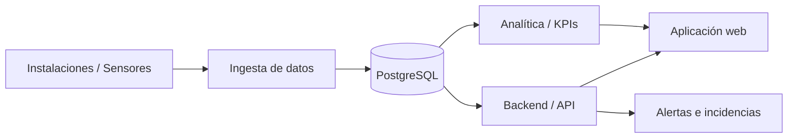

# Mikel Trueba Control

Sistema web demostrador para la **supervisión, mantenimiento, automatización y analítica de instalaciones deportivas**.

## Objetivo

El proyecto explora cómo centralizar información técnica de un polideportivo para apoyar:

- supervisión de instalaciones y equipos;
- checklist preventivo;
- seguimiento de incidencias;
- monitorización mediante sensores;
- control de consumos y parámetros operativos;
- generación de indicadores y KPIs;
- elaboración de informes de seguimiento.

## Caso de estudio

**Polideportivo Mikel Trueba — Santurtzi (Bizkaia).**

El proyecto se ha desarrollado como **MVP / demostrador de portafolio**. Los datos publicados en este repositorio son **sintéticos** y no representan mediciones operativas reales del centro.

## Capturas del MVP

Las siguientes imágenes corresponden al demostrador web y han sido **sanitizadas para su publicación en el portafolio**. No muestran credenciales, datos personales ni información operativa real.

### 1. Panel general

Vista principal del centro de operaciones, con navegación, estado general, indicadores y acceso a los módulos del MVP.


### 2. Aviso de alcance y estado

La interfaz identifica expresamente la ventana de datos sintéticos y diferencia el catálogo MVP de una instalación real de sensores o de una conexión directa con PLC/BMS.


### 3. Módulos disponibles

Navegación del demostrador: panel general, inventario y esquemas, puntos de medida, checklist, incidencias, costes y ahorro, analítica, automatizaciones y seguridad.


### 4. Indicadores sintéticos

Ejemplo de tarjetas de seguimiento utilizadas para representar puntos del catálogo MVP, registros documentales e indicadores demostrativos.


> **Nota:** las cifras mostradas en las capturas son demostrativas y no deben interpretarse como estados, mediciones o resultados operativos reales del Polideportivo Mikel Trueba.

## Contexto funcional

El proyecto toma como referencia necesidades reales de mantenimiento integral de instalaciones deportivas: gestión de órdenes e incidencias, inventario técnico, monitorización, históricos, alarmas, control de parámetros e informes periódicos.

## Estado del proyecto

| Área | Estado |
|---|---|
| Concepto funcional | Completado |
| MVP web demostrativo | Completado |
| Datos sintéticos | Disponibles |
| Modelo de datos demostrativo | Disponible |
| SQL de ejemplo | Disponible |
| Analítica Python de ejemplo | Disponible |
| Integración con sensores reales | No implementada |
| Backend productivo | No implementado |
| Base de datos productiva | No implementada |
| Despliegue municipal | No implementado |

## Arquitectura conceptual



> La arquitectura anterior representa la **arquitectura objetivo**. El repositorio público contiene únicamente componentes demostrativos y datos sintéticos.

## Estructura

```text
mikel-trueba-control/
├── README.md
├── .gitignore
├── requirements.txt
├── docs/
│   ├── arquitectura.md
│   ├── modelo_datos.md
│   ├── metodologia.md
│   └── kpis.md
├── data/
│   └── datos_sinteticos.csv
├── sql/
│   ├── schema_demo.sql
│   └── consultas_kpi.sql
├── src/
│   └── ejemplo_analitica.py
└── screenshots/
    ├── 01_panel_general.jpg
    ├── 02_aviso_estado.jpg
    ├── 03_modulos_disponibles.jpg
    ├── 04_indicadores_sinteticos.jpg
    └── README.md
```

## Componentes demostrativos

### Datos

`data/datos_sinteticos.csv` contiene mediciones ficticias de variables como temperatura, pH, cloro y consumo energético.

### SQL

`sql/schema_demo.sql` define un modelo relacional simplificado para instalaciones, equipos, sensores, mediciones, incidencias y mantenimiento.

`sql/consultas_kpi.sql` incluye consultas de ejemplo para indicadores operativos.

### Python

`src/ejemplo_analitica.py` muestra un flujo sencillo de carga, validación y agregación de datos sintéticos con pandas.

## Tecnologías representadas

- SQL
- PostgreSQL
- Python
- pandas
- modelado relacional
- análisis de datos
- KPIs
- arquitectura de datos
- automatización de procesos
- desarrollo de aplicaciones web

## Seguridad y privacidad

Este repositorio **no debe contener**:

- credenciales;
- contraseñas;
- tokens o API keys;
- cadenas de conexión;
- datos personales;
- datos operativos reales;
- copias de bases de datos municipales;
- configuraciones productivas;
- documentación confidencial.

## Documentación

- [Arquitectura](docs/arquitectura.md)
- [Modelo de datos](docs/modelo_datos.md)
- [Metodología](docs/metodologia.md)
- [KPIs](docs/kpis.md)

## Finalidad del repositorio

Repositorio público orientado a **portafolio profesional**. Su objetivo es mostrar la traducción de una necesidad operativa real a un diseño de datos, arquitectura, analítica y solución web, sin publicar información sensible ni componentes productivos.
