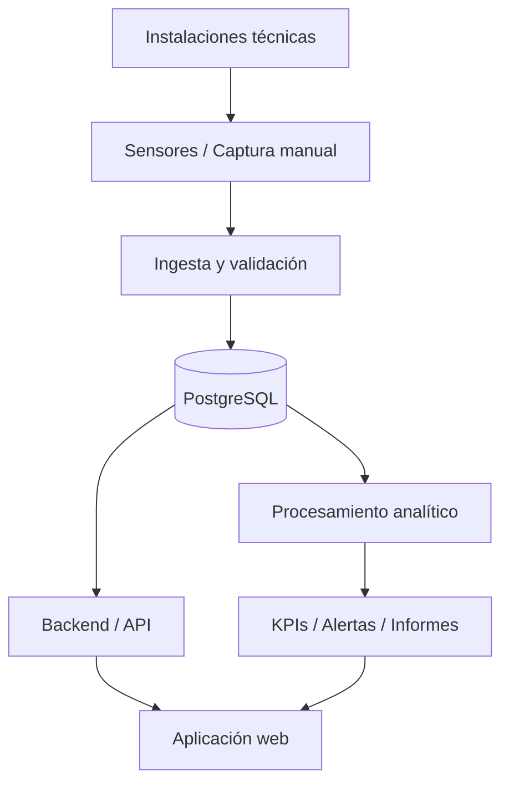

# Arquitectura del sistema

## Objetivo

Definir una arquitectura de referencia para centralizar información técnica, mantenimiento, sensores, incidencias y analítica de una instalación deportiva.

## Arquitectura objetivo

## Capas

### 1. Captura
Fuentes potenciales:
- sensores;
- lecturas manuales;
- partes de mantenimiento;
- incidencias;
- consumos energéticos;
- inventario técnico.

### 2. Persistencia
PostgreSQL como base de datos relacional para:
- instalaciones;
- equipos;
- sensores;
- mediciones;
- incidencias;
- intervenciones;
- mantenimiento preventivo.

### 3. Backend
Responsable de:
- reglas de negocio;
- acceso a datos;
- autenticación y autorización;
- API;
- validaciones.

### 4. Analítica
Cálculo de:
- tendencias;
- medias y extremos;
- desviaciones;
- incidencias;
- consumos;
- cumplimiento de mantenimiento.

### 5. Presentación
Aplicación web para:
- dashboard;
- checklist;
- inventario;
- incidencias;
- histórico de sensores;
- KPIs.

## Estado

Esta arquitectura es **conceptual y de portafolio**. No implica que todos los componentes estén desplegados en producción.
