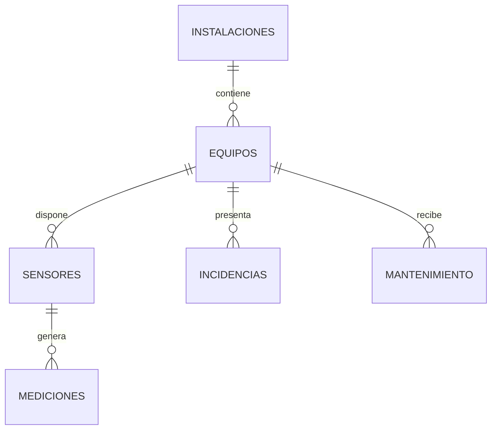

# Modelo de datos

## Objetivo

Representar de forma relacional los principales objetos necesarios para la supervisión y mantenimiento de instalaciones deportivas.

## Entidades principales

| Entidad | Finalidad |
|---|---|
| instalaciones | Agrupa zonas o sistemas técnicos |
| equipos | Inventario de activos técnicos |
| sensores | Dispositivos o puntos de medida |
| mediciones | Histórico temporal de valores |
| incidencias | Registro de anomalías o averías |
| mantenimiento | Intervenciones preventivas o correctivas |

## Relaciones

## Criterios de diseño

- claves primarias técnicas;
- claves foráneas explícitas;
- separación entre maestro de activos y datos temporales;
- histórico de mediciones no sobrescribible;
- estados normalizados;
- posibilidad de ampliar catálogos sin alterar la estructura base.

El esquema SQL disponible en `sql/schema_demo.sql` es una versión simplificada para demostración.
